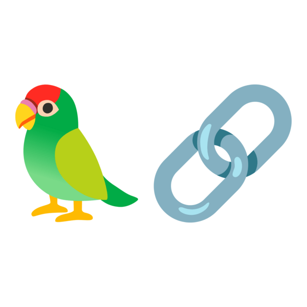

## Yanis GUERIF

### Étudiant en BUT Informatique à Lannion

## Outils et Système :

## Langages :

### Programmation :

### Web :

### Base de données :

### Passion: IA local et Agentique

<figure>
    
</figure>

<figure>
    
</figure>

<figure>
    
</figure>

<figure>
    
</figure>

## Contact :

### Mail :

[yanis.guerif@etudiant.univ-rennes.fr](mailto:yanis.guerif@etudiant.univ-rennes.fr)

### Linkedin :

https://www.linkedin.com/in/yanis-guerif-068953386/
